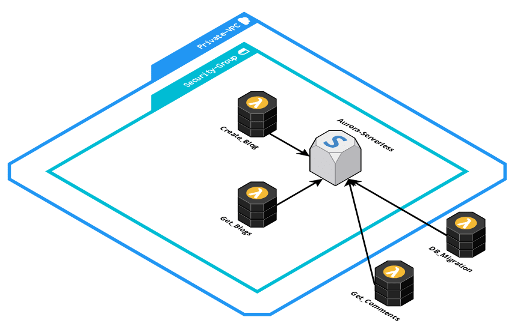

[Amazon Aurora Serverless](https://aws.amazon.com/rds/aurora/serverless/) is the goto relational database choice for Serverless application on AWS.

Developers usually confront two problems when using Aurora Serverless.

- Connection pool management is really hard when using Lambda's. A flood of requests from quickly scaling Lambda's can bring the database to it's knees.
- The Data API is too slow. With latencies around [150 to 250 ms](https://www.jeremydaly.com/aurora-serverless-data-api-a-first-look/) for even a simple request.

So which method do you use to connect to your database?

**The answer is both.**

Use connection pools and precious direct database connections to handle user facing API's and time critical operations.

Use the Data API for background/scheduled processes, running database migrations or access data that can be lazy loaded in an app.

In the example architecture above, which represents a blogging platform, we use connection pools and a direct connection to the database to create and fetch a blog post. This requires lambda's to be inside a VPC, along with the RDS database.

Use the Data API to lazy load all the comments for the blog post. The Data API can be accessed from outside the VPC.
